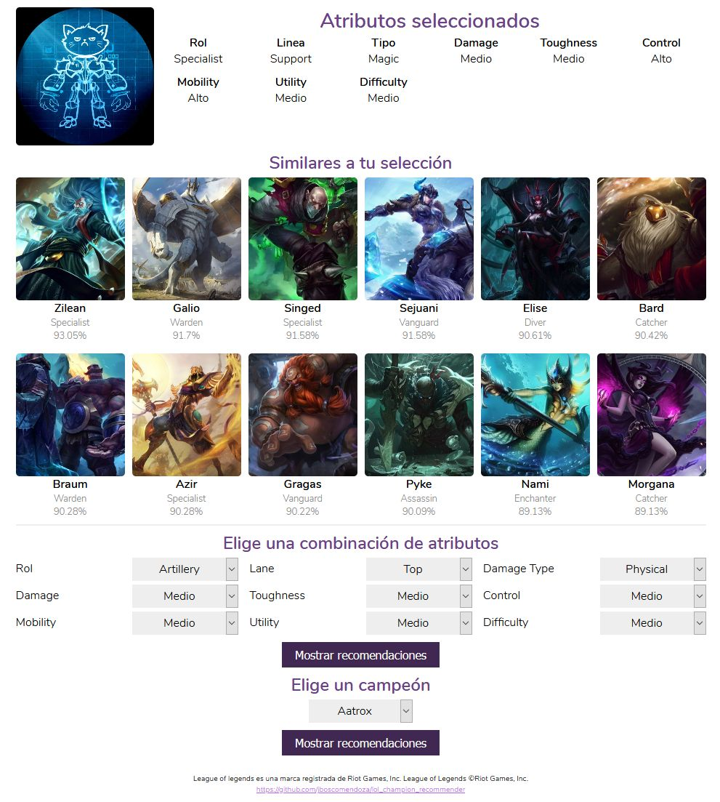

# Recomendador de Campeones de League of Legends.

El algoritmo de recomendación es Distancia de Coseno, usando datos extraídos de los siguientes sitios:
* https://na.leagueoflegends.com/en-us/champions/
* https://leagueoflegends.fandom.com/

Lo archivos principales son:
* app.py: Aplicación de Flask.
* recommender.py: Funciones del algoritmo de recomendador.
* scrapping.py: Funciones para scrapping de datos usados en el recomendador.
* champions.csv: Tabla con los datos de los campeones de League of Legends.

La versión live de esta aplicación se encuentra en:
* https://lol-champion-recommender.herokuapp.com/

Screenshot

